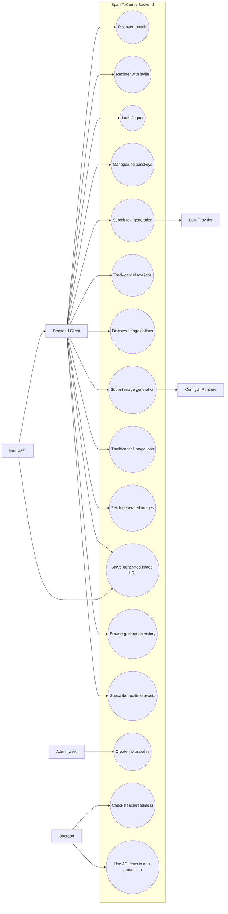

# SparkToComfy Product Overview

Status: Active
Last updated: 2026-07-05
Owner: SparkToComfy (main)

This is the product-level view of SparkToComfy: who uses it and what they can do.
It is a curated mirror of the authoritative, implementation-level source in
`SparkToComfy-backend/docs/SPEC/USE_CASES_AND_FLOWS.md`, which additionally holds
the detailed auth, generation, image, history, WebSocket, and runtime flow
diagrams. When product behavior and the backend SPEC disagree, the backend SPEC
wins: update it first, then reflect product-level changes here.

## Actors

| Actor | Description |
|---|---|
| End User | Person using SparkToComfy through the frontend. |
| Frontend Client | Browser app calling HTTP/WebSocket APIs. |
| Authenticated User | End user with a valid local session cookie. |
| Admin User | Authenticated local user with invite-code privileges. |
| Backend | FastAPI app and runtime services. |
| LLM Provider | OpenAI, Anthropic, Gemini, or OpenAI-compatible upstream. |
| ComfyUI Runtime | External ComfyUI HTTP/WebSocket service. |
| Operator | Person configuring, deploying, or debugging the deployment. |

## Use Case Diagram

## User Stories

| ID | Story | Acceptance criteria | Primary SPEC |
|---|---|---|---|
| US-001 | As a frontend user, I want to see available models so I can choose a generation target. | `GET /v1/models` returns providers/models/public thinking options and no secrets or legacy labels. | [API_CONTRACT](../../SparkToComfy-backend/docs/SPEC/specs/API_CONTRACT.md) |
| US-002 | As a user, I want to register with an invite code so access is controlled. | Backend validates the invite during registration; valid invite creates user; invalid/reused invite is rejected. | [AUTH](../../SparkToComfy-backend/docs/SPEC/specs/AUTH.md) |
| US-003 | As a user, I want to login and stay authenticated so my jobs are scoped to me across clients. | Login sets HttpOnly cookie; protected job scope becomes `user:{user_id}` while `X-Client-ID` remains source-client metadata. | [AUTH](../../SparkToComfy-backend/docs/SPEC/specs/AUTH.md) |
| US-004 | As a user, I want passkey login so I can authenticate without typing a password. | WebAuthn options and verify endpoints create/consume challenges and issue session cookie. | [AUTH](../../SparkToComfy-backend/docs/SPEC/specs/AUTH.md) |
| US-005 | As a user, I want to submit quick prompts so I can generate text from structured fields. | Quick mode requires nonblank `identity`; `costume` and `composition` may be blank or omitted and are sent unchanged as blank sections; valid request creates a job. | [GENERATION](../../SparkToComfy-backend/docs/SPEC/specs/GENERATION.md) |
| US-006 | As a user, I want to submit detailed prompts so long-form input is supported. | Detailed mode requires `detailed_input`; valid request creates a job. | [GENERATION](../../SparkToComfy-backend/docs/SPEC/specs/GENERATION.md) |
| US-007 | As a user, I want safe retry behavior so duplicate clicks do not duplicate provider calls. | Same idempotency key/request replays; changed request with same key conflicts. | [GENERATION](../../SparkToComfy-backend/docs/SPEC/specs/GENERATION.md) |
| US-008 | As a user, I want realtime feedback while generation runs. | SSE job status or WebSocket generation events report progress/deltas. | [API_CONTRACT](../../SparkToComfy-backend/docs/SPEC/specs/API_CONTRACT.md) |
| US-009 | As a user, I want to discover image options for the fixed backend workflow. | `GET /v1/images/options` returns backend-owned base model options, quality/negative prompt options, public LoRA labels/IDs/strength metadata, sampler/scheduler choices, defaults, limits, and upscale availability without workflow names, workflow IDs, runtime names, or LoRA tags. | [GENERATION](../../SparkToComfy-backend/docs/SPEC/specs/GENERATION.md) |
| US-010 | As a user, I want to generate images through the backend-selected ComfyUI workflow and see my place in line. | Enabled gateway rejects frontend `workflow_id`, validates fixed workflow controls/LoRA/upscale branches, dispatches accepted jobs to ComfyUI immediately, and returns image job snapshots whose `queue.position` reflects the job's real place in ComfyUI's queue. | [GENERATION](../../SparkToComfy-backend/docs/SPEC/specs/GENERATION.md) |
| US-011 | As a user, I want to open generated image URLs directly. | Job result image `url` is a same-origin relative view-proxy URL `/v1/images/view?filename=...&subfolder=...&type=output` that the browser resolves against the app origin and fetches without custom headers or cookies; the backend streams the bytes from ComfyUI. | [API_CONTRACT](../../SparkToComfy-backend/docs/SPEC/specs/API_CONTRACT.md), [GENERATION](../../SparkToComfy-backend/docs/SPEC/specs/GENERATION.md) |
| US-012 | As a user, I want to share a generated image URL so another browser can view it without custom headers. | The absolute form of the view URL is safe to copy or use in `` for anyone, including unregistered users; the route is public with a parameter whitelist. | [API_CONTRACT](../../SparkToComfy-backend/docs/SPEC/specs/API_CONTRACT.md), [GENERATION](../../SparkToComfy-backend/docs/SPEC/specs/GENERATION.md) |
| US-013 | As an admin, I want to create invite codes. | Admin session can create invite codes; non-admin cannot. | [AUTH](../../SparkToComfy-backend/docs/SPEC/specs/AUTH.md) |
| US-014 | As an operator, I want readiness checks and runtime status broadcasts. | Readiness returns config, provider-key, and cached ComfyUI dependency state; `/v1/ws` emits `runtime_status`; per-job provider diagnostics live in durable prompt history. | [RUNTIME_OPERATIONS](../../SparkToComfy-backend/docs/SPEC/specs/RUNTIME_OPERATIONS.md) |
| US-015 | As an operator/developer, I want interactive API docs in dev/staging but not production. | `APP_ENV=development` and `APP_ENV=staging` expose `/docs`, `/redoc`, and `/openapi.json`; `APP_ENV=production` returns 404 for all three, even with `STATIC_DIR` configured. | [API_CONTRACT](../../SparkToComfy-backend/docs/SPEC/specs/API_CONTRACT.md), [RUNTIME_OPERATIONS](../../SparkToComfy-backend/docs/SPEC/specs/RUNTIME_OPERATIONS.md) |
| US-016 | As a user, I want separate prompt and image history so I can revisit completed work in the matching workspace after runtime job state expires. | `GET /v1/prompts/history` lists prompt/text history, `GET /v1/images/history` lists image history, both are owner-scoped newest-first pages, and image entries render through `image.url`. | [API_CONTRACT](../../SparkToComfy-backend/docs/SPEC/specs/API_CONTRACT.md), [GENERATION](../../SparkToComfy-backend/docs/SPEC/specs/GENERATION.md) |

## Detailed Flows

Detailed flow, sequence, and state diagrams — auth, registration, text/image
generation, image retrieval, prompt/image history, WebSocket subscription, runtime
startup, and rate-limit branches — live in the backend SPEC and are the
authoritative source:

- `SparkToComfy-backend/docs/SPEC/USE_CASES_AND_FLOWS.md`
- `SparkToComfy-backend/docs/SPEC/INTERACTION_DIAGRAMS.md`
- `SparkToComfy-backend/docs/SPEC/specs/` — `API_CONTRACT.md`, `AUTH.md`, `GENERATION.md`, `RUNTIME_OPERATIONS.md`
